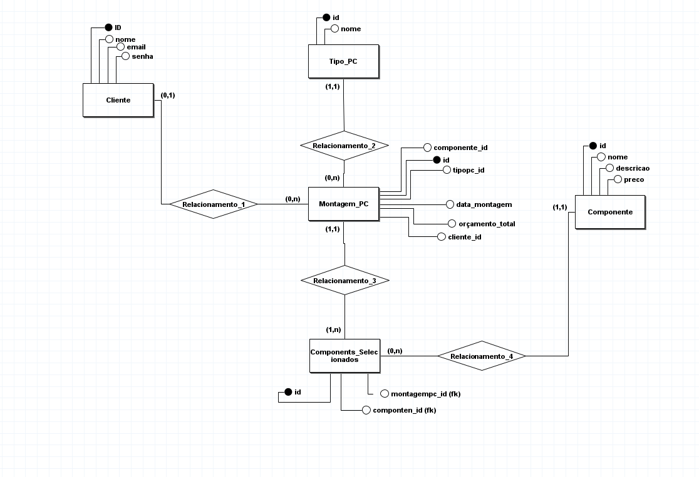

# Projeto Integrador III - Assistente de montagem de PC:

Integrantes: Alexsandro Alves, Arthur Silva, Eliseu Ferreira, Kayke Ribeiro, Samuel Levi
Professor: Enoque Leal

Principais requisitos:

Nosso projeto tem como principal objetivo: auxiliar o usuário a realizar a montagem de um pc personalizado que corresponda às suas necessidades.
Que esteja de acordo com o seu orçamento, possibilitando ao usuário a inteligibilidade e facilidade mesmo para pessoas leigas
com pouco ou nenhum conhecimento em especificações técnicas do hardware.

-Pagina Inicial
-pagina de login
-pagina de cadastro
-CRUD - Operador site
-Tela Usuario
-Tela de Categorias
-Tela de especificações

.

